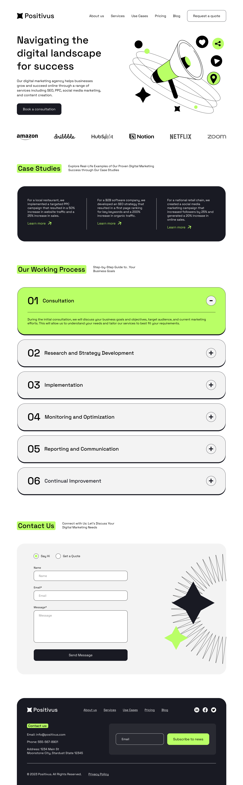

# Positivus

Responsive landing page for a digital agency, built from a Figma design with a focus on clean architecture, scalability and modern CSS techniques.

Live demo: https://zxsabyrka.github.io/positivus/

## Preview



## About

This project is a fully responsive website developed without UI kit or predefined design system.  
All design decisions such as spacing, typography scaling and breakpoints were analyzed and implemented manually.

The main goal was not just to replicate the layout, but to build a maintainable and scalable styling architecture.

## Features

- Semantic and accessible HTML structure
- SCSS architecture with `@use` / `@forward`
- BEM methodology
- Modular styles (components, layout, base, abstracts)
- Fluid typography using `clamp()`
- Custom media mixins with flexible breakpoints
- Combination of desktop-first and mobile-first approaches
- CSS variables for dynamic layout control
- Fully responsive without relying on frameworks

## Tech Stack

- HTML5
- SCSS (Sass)
- CSS3

## Project Structure

```
├── assets/
│   ├── favicon/
│   ├── fonts/
│   ├── images/
│   └── preview.png
│
├── styles/
│   ├── abstracts/
│   ├── base/
│   ├── components/
│   ├── layout/
│   ├── utils/
│   ├── main.min.css
│   └── main.scss
│
├── index.html
└── README.md
```

## Notes

The project intentionally avoids JavaScript and external libraries to focus on layout, architecture and styling techniques.

Several non-trivial layout solutions were implemented using CSS variables and calculated offsets to achieve pixel-perfect results across breakpoints.
